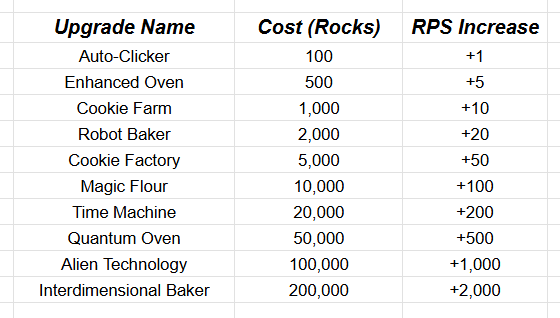

# Rock lore

That Time I Got Reincarnated as a Rock in a Mining Cookie-Clicker Game is an idle clicker game where players take on the role of a reincarnated rock. The primary objective is to mine as many rocks as possible to purchase upgrades that automate and accelerate your rock-collection rate.

Starting with manual clicks to generate rocks, players can use their earnings to acquire a variety of upgrades, from an Auto-Clicker to an Interdimensional Baker. Each upgrade boosts the rocks-per-second (RPS) rate, enabling players to progress from simple manual mining to an automated rock-collecting empire. The game features a simple, engaging loop of clicking, earning, and upgrading to achieve astronomical rock counts.

# Upgrade Tier List

- This chart shows all available upgrades, their costs, and the corresponding rock-per-second (RPS) gain for each

