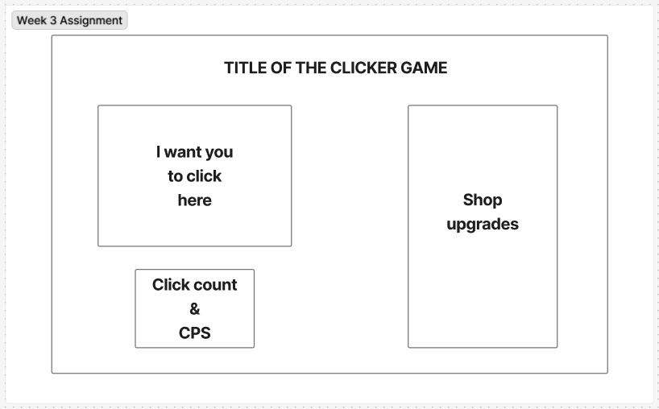

# Reflection

For this week's assignment, we had to build a simple interactive game to engage visitors. Games like these are known as idle games or incremental games. I found this assignment a bit easier than last week's, mainly because we focused more on JavaScript throughout the week, which improved my understanding. It also helped that I was able to use some of the same methods from last week's assignment. Additionally, I'm finding it really useful to leave notes in my code, especially in JavaScript, to help me remember the steps and understand what each part does. I had hoped I would have had more time to style the game a bit more, but I made sure that everything was working first and all the main goals were met.

# Requirements

- ✅ 🎯 Fetch upgrade data from the provided API and at least one upgrade from the API update the cookie count.
- ✅ 🎯 Ensure that functions are used effectively to keep code organised and reusable.
- ✅ 🎯 Implement event listeners to handle user interactions.
- ✅ 🎯 Use local storage to save and restore the cookie count and relevant game information.
- ✅ 🎯 Use setInterval to increment the cookie count and manage the game state each second. Managing the game state includes saving progress and updating the DOM.

# Stretch Requirements

- ✅ 🏹 Consolidate upgrade management by managing all upgrades in a single function.
- ✅ 🏹 Improve UX with animations, sound effects, or other visual effects.
- ✅ 🏹 Create a menu for users to adjust game options like sound effects or display preferences.

# requirements that I wasn't able to achieve

- ❌ 🏹 Fantastic use of README to provide important information such as a description of the project, how to deploy and other app information.
- ❌ 🏹 Implement error handling using try/catch.

# External sources

### Info

- My own repo - https://github.com/IndieMasco/TechEdSoftwareDeveloper021
- Tech Ed repo - https://github.com/Tech-Educators/software-dev-021
- FigJam - https://www.figma.com/board/JjN2Zgtoynrau06MjWJs6q/SD021?node-id=0-1&p=f&t=V1WCGcrmVKnoxJDr-0
- MDN - https://developer.mozilla.org/en-US/
- W3School - https://www.w3schools.com/

### Tutorials

Click counter - https://www.youtube.com/watch?v=1sri-wG8RJg

# Wireframe

- This was my original design for my Cookie Clicker game, but as you can tell, the finished product has changed a little. That's mainly due to how I wanted the clickable image to sit with the background so it didn't look out of place

# Feedback Request

If there is anything you think I could do better or improve on, I'd be happy to listen and learn from what you have to say.

# Audio

- Sound Effect by <a href="https://pixabay.com/users/freesound_community-46691455/?utm_source=link-attribution&utm_medium=referral&utm_campaign=music&utm_content=6462">freesound_community</a> from <a href="https://pixabay.com/sound-effects//?utm_source=link-attribution&utm_medium=referral&utm_campaign=music&utm_content=6462">Pixabay</a>